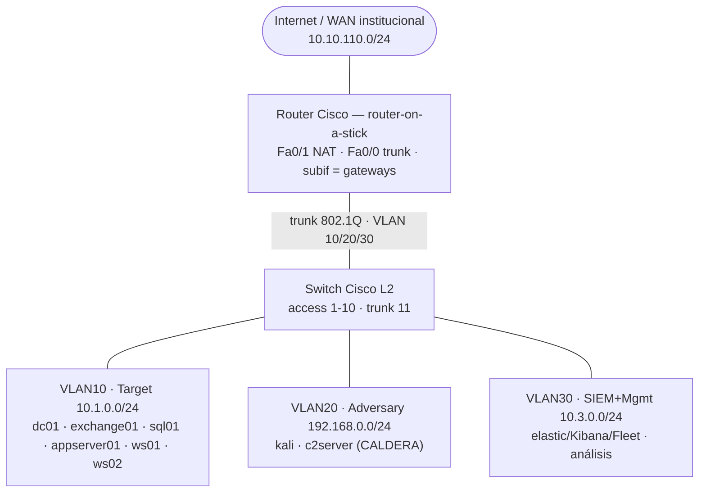

# Cyber Range — Arquitectura

Cyber Range virtualizado que **emula tres grupos APT** (APT29, OilRig, Wizard Spider) con
MITRE CALDERA y **detecta** los ataques con Elastic Stack (SIEM + Elastic Defend EDR + ML de
anomalías). Proyecto de tesis — Trabajo de Suficiencia Profesional, FIEE-UNI.

!!! abstract "Cómo leer esta guía"
    Empieza por esta página (arquitectura). Luego sigue la sección **Implementación** en
    orden: cada paso depende del anterior.

## Qué hace

Un operador ejecuta un escenario APT scripteado, observa **telemetría real** (host + red),
**detecta** la intrusión en Kibana, y **resetea** todo a estado limpio en un comando para
repetir el ejercicio.

## Topología

## Las tres redes (VLANs)

| VLAN | Red | Rol |
|------|-----|-----|
| **10** | `10.1.0.0/24` | **Target / Enterprise** — dominio AD, servidores, workstations (víctima) |
| **20** | `192.168.0.0/24` | **Adversary** — Kali + CALDERA C2 (ataque) |
| **30** | `10.3.0.0/24` | **SIEM + Gestión** — Elastic / Kibana / Fleet (detección) |

Switch Cisco **L2** (segmentación) + router Cisco (**router-on-a-stick**: inter-VLAN + NAT).
Detalle de direccionamiento y config Cisco en [Diseño de red](network-design.md).

## Componentes

- **Red Team**: CALDERA (planes CTID) · Kali (Metasploit, Impacket, Mimikatz, BloodHound).
- **Blue Team**: Elastic Stack 8.x (Elasticsearch, Kibana, Fleet, Elastic Defend, ML).
- **Telemetría**: Sysmon (host) + Packetbeat (red) + Windows Event Log.
- **Infra**: Proxmox VE 8.x en 6 PCs; reset por snapshots.

## Metodología de implementación

Orden secuencial (cada paso depende del anterior):

1. **[Hosts Proxmox](guias/01-proxmox.md)** — hipervisor + provisión de VMs.
2. **[DC / Active Directory](guias/02-dc-ad.md)** — dominio `lab.local` (base de todo lo demás).
3. **[Exchange](guias/03-exchange.md)** — correo + EWS *(diferido a fase posterior)*.
4. **[SQL Server](guias/04-sql-server.md)** — datos del escenario OilRig.
5. **[App Server](guias/05-appserver.md)** — servicio Linux + telemetría cross-platform.

!!! info "Transversal"
    La [superficie vulnerable intencional](vulnerable-surface.md) explica **qué** hace
    explotables a los targets (hardening-down + misconfigs AD + CVEs sembrados) y **cómo**
    garantizarlo de forma reproducible.
