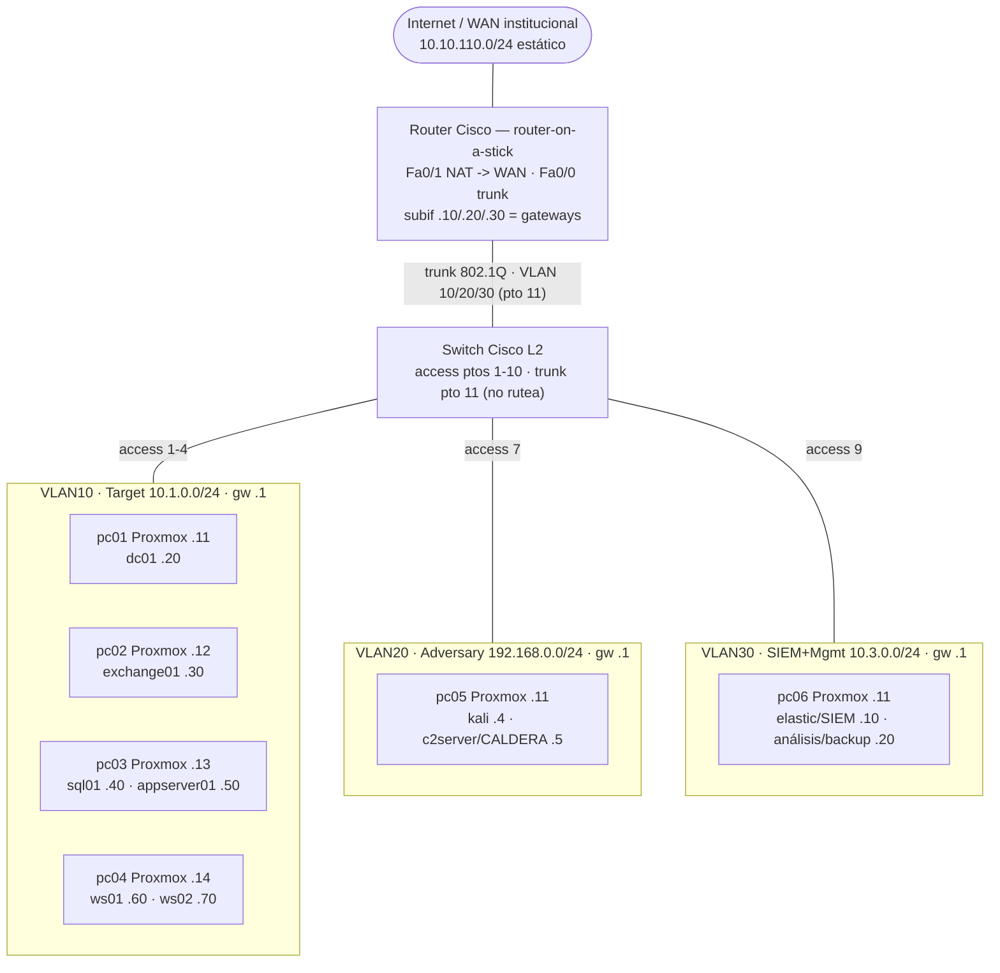

# Network Design — Cyber Range

Arquitectura de red del cyber range: **switch Cisco L2** + **router Cisco en router-on-a-stick** (inter-VLAN + NAT), 3 VLANs, 6 PCs con Proxmox.

> Diagrama interactivo (light/dark): <https://claude.ai/artifact/1bMThfSuiFPuVUU5Sn57Kb>

## Topología



## Mapa físico de puertos

| Equipo | Puerto switch | Modo / VLAN | Red |
|--------|---------------|-------------|-----|
| pc01 | 1 | access 10 | 10.1.0.0/24 |
| pc02 | 2 | access 10 | 10.1.0.0/24 |
| pc03 | 3 | access 10 | 10.1.0.0/24 |
| pc04 | 4 | access 10 | 10.1.0.0/24 |
| *libre* | 5–6 | access 10 | 10.1.0.0/24 |
| pc05 | 7 | access 20 | 192.168.0.0/24 |
| *libre* | 8 | access 20 | 192.168.0.0/24 |
| pc06 | 9 | access 30 | 10.3.0.0/24 |
| *libre* | 10 | access 30 | 10.3.0.0/24 |
| Router Cisco | 11 | **trunk 802.1Q** | VLAN 10 · 20 · 30 |

## Direccionamiento

Convención por VLAN (mismo /24 compartido por host Proxmox y sus VMs, separado por rango):

| Bloque | Uso |
|--------|-----|
| `.1` | gateway (subinterfaz del router) |
| `.11–.19` | hosts Proxmox (NIC física, IP sobre `vmbr0`) |
| `.20–.199` | VMs (infra + workstations), IP estática |
| `.200–.254` | DHCP / scratch |

### VLAN10 — Target / Enterprise · `10.1.0.0/24` · gw `10.1.0.1`

| Rol | Host | IP |
|-----|------|----|
| Proxmox | pc01 | 10.1.0.11 |
| Proxmox | pc02 | 10.1.0.12 |
| Proxmox | pc03 | 10.1.0.13 |
| Proxmox | pc04 | 10.1.0.14 |
| DC | dc01 | 10.1.0.20 |
| Exchange | exchange01 | 10.1.0.30 |
| SQL | sql01 | 10.1.0.40 |
| App (Linux) | appserver01 | 10.1.0.50 |
| Workstation | ws01 | 10.1.0.60 |
| Workstation | ws02 | 10.1.0.70 |

### VLAN20 — Adversary · `192.168.0.0/24` · gw `192.168.0.1`

| Rol | Host | IP |
|-----|------|----|
| Proxmox | pc05 | 192.168.0.11 |
| Kali | kali | 192.168.0.4 |
| C2 (CALDERA) | c2server | 192.168.0.5 |

### VLAN30 — SIEM + Gestión/Análisis · `10.3.0.0/24` · gw `10.3.0.1`

| Rol | Host | IP |
|-----|------|----|
| Proxmox | pc06 | 10.3.0.11 |
| SIEM (Elastic/Kibana/Fleet) | elastic | 10.3.0.10 |
| Análisis / backup | analysis | 10.3.0.20 |

## Host Proxmox vs red de VMs

Los puertos del switch son **access** (1 VLAN sin etiqueta por puerto) → el host Proxmox y sus VMs **comparten el /24** de la VLAN; no hace falta otra subred, se separa por rango de IP (tabla arriba).

- `vmbr0` = bridge sobre la NIC física del PC.
- El mgmt del host Proxmox vive en `vmbr0` (`.11–.19`).
- Las VMs cuelgan de `vmbr0` → mismo L2/subred, IP estática en `.20–.199`.

**Aislar el plano de gestión** (opcional, no MVP): requiere puerto **trunk** + bridge VLAN-aware (VLAN mgmt dedicada) o una **2da NIC** por PC.

## Ruteo y salida a internet — router-on-a-stick

- **Switch L2**: solo segmenta. Access 1–6 → vlan10, 7–8 → vlan20, 9–10 → vlan30; **pto 11 = trunk** 802.1Q.
- **Router**: subinterfaces `Fa0/0.10/.20/.30` = **gateways**, hacen el inter-VLAN.
- **NAT/PAT** overload en `Fa0/1` (WAN institucional) → internet.
- **ACL** en el router: deny Target↔Adversary; permite Target→SIEM (Fleet/logs) y gestión.
- **DNS**: VMs de dominio → `dc01` (AD); dc01 reenvía a DNS externo vía NAT.

> **Cuello de botella**: con router-on-a-stick el router es chokepoint y punto único de ACL. Cruzan el `Fa0/0` de 100 Mbps (todo inter-VLAN): **telemetría Target→SIEM** (continua, la más pesada), **ataque Adversary→Target** (C2/exploits) e internet. El **intra-VLAN** (lateral movement dentro de Target) se queda en el switch a velocidad de línea. Suficiente para el lab; si satura → switch L3 (SVIs) o router gigabit.

### Config switch (Cisco IOS — ajusta nombres de interfaz a tu modelo)

```text
vlan 10
 name TARGET
vlan 20
 name ADVERSARY
vlan 30
 name SIEM-MGMT
vlan 99
 name NATIVE-UNUSED
!
interface range FastEthernet0/1-6
 switchport mode access
 switchport access vlan 10
interface range FastEthernet0/7-8
 switchport mode access
 switchport access vlan 20
interface range FastEthernet0/9-10
 switchport mode access
 switchport access vlan 30
!
interface FastEthernet0/11
 switchport mode trunk
 switchport trunk allowed vlan 10,20,30
 switchport trunk native vlan 99
```

### Config router (router-on-a-stick + NAT + ACL)

```text
interface FastEthernet0/0
 no ip address
 no shutdown
interface FastEthernet0/0.10
 encapsulation dot1Q 10
 ip address 10.1.0.1 255.255.255.0
 ip nat inside
 ip access-group TGT-IN in
interface FastEthernet0/0.20
 encapsulation dot1Q 20
 ip address 192.168.0.1 255.255.255.0
 ip nat inside
 ip access-group ADV-IN in
interface FastEthernet0/0.30
 encapsulation dot1Q 30
 ip address 10.3.0.1 255.255.255.0
 ip nat inside
!
interface FastEthernet0/1
 ip address <IP-ESTATICA-LAB> 255.255.255.0   ! entregada por la red institucional
 ip nat outside
 no shutdown
!
ip access-list standard NAT-LAN
 permit 10.1.0.0 0.0.0.255
 permit 192.168.0.0 0.0.0.255
 permit 10.3.0.0 0.0.0.255
ip nat inside source list NAT-LAN interface FastEthernet0/1 overload
!
ip route 0.0.0.0 0.0.0.0 <GW-INSTITUCIONAL>
!
! Segmentación: Target <-> Adversary bloqueado, resto permitido
ip access-list extended TGT-IN
 deny   ip 10.1.0.0 0.0.0.255 192.168.0.0 0.0.0.255
 permit ip any any
ip access-list extended ADV-IN
 deny   ip 192.168.0.0 0.0.0.255 10.1.0.0 0.0.0.255
 permit ip any any
```

## Supuestos / decisiones abiertas

- Red adversario = `192.168.0.0/24` (corregido de `192.68`).
- VLAN30 combina **SIEM + Gestión/Análisis** (en la referencia original eran 2 VLANs). Separar si se requiere.
- Ubicación de VMs por host = sugerencia; balancear por RAM.
- `native vlan 99` en el trunk = higiene (VLAN sin uso); ajustar si el switch exige otra.
